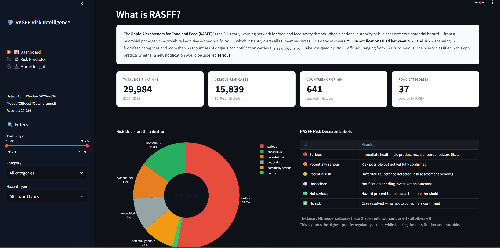
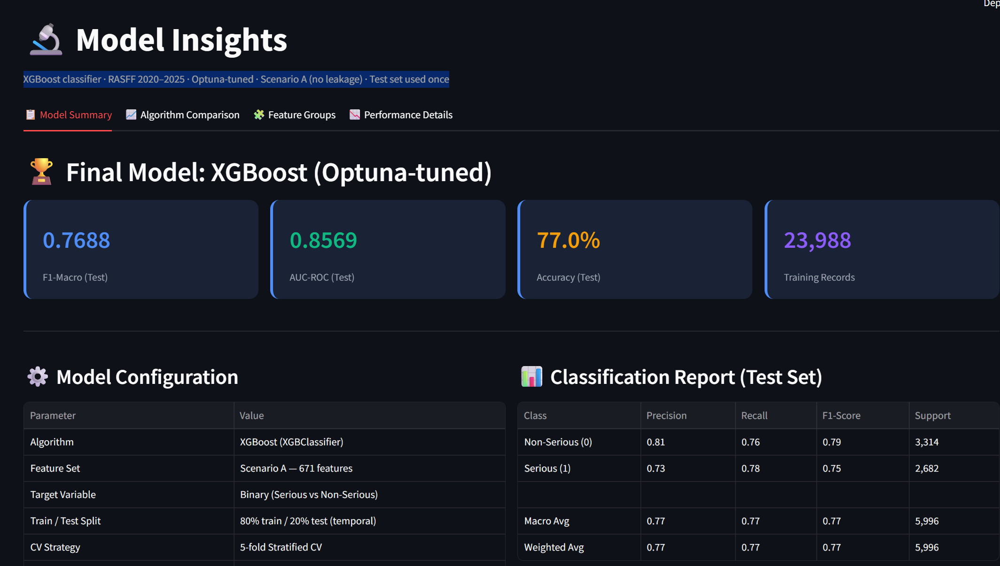

# 🛡️ RASFF Risk Prediction System
### *Predicting food safety alert severity using machine learning on EU regulatory data*

[](https://hyejeong0617-rasff-risk-predictor-rasff-app-xpyl1f.streamlit.app/)
[](https://www.python.org/)
[](https://streamlit.io/)
[](https://xgboost.readthedocs.io/)
[](LICENSE)

---

## 👩‍🔬 About This Project

A food microbiology and life sciences PhD applies machine learning to a domain they know deeply — EU food safety regulation. Rather than working on a generic tutorial dataset, this project uses rigorous ML methodology on real-world regulatory data, combining scientific domain expertise with modern data analysis.

| Capability | What this project demonstrates |
|------------|-------------------------------|
| **Domain knowledge → feature design** | MNAR diagnosis, leakage detection, and LLM-based hazard classification all derived from food safety domain understanding |
| **Rigorous ML methodology** | Chronological split, train-only encoder fitting, single test set evaluation, ablation study, concept drift acknowledgment |
| **End-to-end engineering** | Raw regulatory CSV → LLM feature extraction → feature engineering → hyperparameter tuning → interactive web app |
| **Results communication** | Streamlit dashboard designed for non-technical regulatory stakeholders |

---

## 📌 Project Overview

This project builds an **end-to-end machine learning pipeline** to predict whether a food safety notification submitted to the **EU RASFF (Rapid Alert System for Food and Feed)** will be classified as a **serious risk** — before any official risk assessment is completed.

> **Why this matters:**
> When a hazard is detected — a microbial pathogen, a pesticide residue, an undeclared allergen — national authorities file a notification and RASFF officials assign a `risk_decision` label that drives response urgency: border seizures, product recalls, and public health alerts. **Predicting this label at submission time could help regulators prioritize resources faster and protect public health more efficiently.**

---

## 🖥️ Application Preview

### Page 1 — RASFF Data Dashboard

*Interactive dashboard: risk decision distribution, notification trends (2020–2026), top food categories, origin countries, and category × hazard heatmap. Sidebar filters by year, category, and hazard type.*

### Page 2 — Risk Level Predictor
.png)
*Enter a notification's category, origin, subject text, and hazard type to receive a serious-risk probability estimate, factor breakdown chart, and similar historical cases.*

.png)
*Prediction output: serious-risk probability gauge, risk factor contribution chart, and similar historical cases from the RASFF database.*

### Page 3 — Model Insights

*Full model transparency: algorithm comparison (XGBoost vs LightGBM vs RF vs LR), feature group ablation, classification report, concept drift analysis, and pipeline summary.*

---

## ⚙️ Key Technical Decisions & Why They Matter

These decisions distinguish a production-minded approach from a tutorial-style model:

| Decision | Rationale |
|----------|-----------|
| **Chronological train/test split** | Food safety trends evolve over time. Random splitting leaks future data into training, giving an unrealistically optimistic performance estimate. |
| **Excluding `classification` from features** | `classification` is assigned *after* `risk_decision` is determined — including it constitutes data leakage. The operational model must predict risk at submission time, before classification type is known. |
| **Preserving `hazards_missing` as a feature** | The `hazards` field is MNAR — its missingness correlates strongly with risk level (Cramér's V = 0.275, more predictive than `Hazard_Type`). Imputing or dropping it destroys this signal. |
| **LLM classification for `Hazard_Type`** | `hazards` is missing for 26% of rows. GPT-4o-mini classifies the always-present `subject` text into 9 hazard types, providing full-coverage coarse signal that complements the structured hazard features. |
| **Sentence embeddings for `subject`** | 26,158 unique subject values — too high for OHE. Semantic similarity matters ("Salmonella in chicken" ≈ "Salmonella in poultry"). `all-MiniLM-L6-v2` captures this in 384 dimensions (+0.052 F1 over hazard features alone). |
| **F1-macro as primary metric** | Mild class imbalance (~50% serious). F1-macro weights both classes equally, preventing the model from defaulting to the majority class. |
| **Concept drift acknowledged, not hidden** | Serious-notification rate declined 54.8% (train) → 44.7% (test), reflecting a real RASFF regulatory trend from 2020→2026 — not a data error. Honest reporting of this is essential. |

---

## 🔬 The Data: RASFF Window

| Attribute | Value |
|-----------|-------|
| **Source** | [RASFF Window](https://webgate.ec.europa.eu/rasff-window/screen/search) (EU Commission) |
| **Coverage** | January 2020 – April 2026 |
| **Records** | 29,984 notifications |
| **Food/feed categories** | 37 |
| **Countries of origin** | 600+ |
| **Target variable** | `risk_decision` (6 labels → binarized: Serious / Non-Serious) |

Each notification contains the product category, country of origin, a free-text `subject` line, a structured `hazards` field, and a `risk_decision` label assigned by RASFF officials — ranging from `no risk` to `serious`.

---

## 🏗️ Pipeline: Four Notebooks

### NB1 · Data Processing & Hazard Classification

**Goal:** Transform the raw RASFF export into a clean, feature-rich dataset.

- **Data cleaning:** Standardized encodings, parsed dates, resolved structural anomalies
- **Missing value analysis (MCAR / MAR / MNAR):** The `hazards` field (26.1% missing) is **MNAR** — missingness is itself a risk signal. When `hazards` is present, 59.9% of notifications are serious; when absent, only 32.7% are. The binary indicator `hazards_missing` was preserved as a feature.
- **Hazard feature extraction** from the structured `hazards` field:
  - `hazard_tag` — RASFF internal category tag (e.g. `pesticide residues`)
  - `hazard_substance` — Primary substance name (e.g. `chlorpyrifos`)
- **LLM-based hazard classification:** GPT-4o-mini classifies each notification's free-text `subject` into one of **9 Hazard Types**, providing full-coverage coarse signal even for the 26% of rows where `hazards` is missing.

> **Domain insight:** `Hazard_Type` is derived from `subject`, not from `hazards`. These two columns capture complementary information from different sources — using both as independent feature groups preserves signal that would be lost by collapsing them.

**Outputs:** `data/rasff_clean.csv`, `data/rasff_classified.csv`, `data/rasff_clean2.csv`

---

### NB2 · EDA & Feature Analysis

**Goal:** Quantify feature–target associations and justify all encoding decisions for NB3.

Cramér's V was computed for all candidate features against `risk_decision`:

| Feature | Cramér's V | Notes |
|---------|-----------|-------|
| `hazards` (raw text) | **0.467** | Strongest predictor |
| `hazard_substance` | **0.363** | Near as strong as raw text |
| `classification` | **0.307** | ⚠️ Post-decision variable → **excluded (leakage)** |
| `subject` | **0.298** | Encoded via sentence embedding |
| `hazards_missing` | **0.275** | MNAR indicator — stronger than `Hazard_Type` |
| `hazard_tag` | **0.235** | Mid-level granularity |
| `Hazard_Type` | **0.206** | LLM coarse signal, 100% coverage |
| `origin` | **0.190** | Country of origin |
| `notifying_country` | **0.170** | Country filing the notification |
| `month` | **0.030** | Near-zero → **dropped** |

**Leakage detection:** `classification` shows V = 0.307 but is a post-decision variable — `risk_decision` is determined first, then `classification` type follows as a consequence (86.9% of `alert notification` rows are `serious`). Two scenarios were defined:
- **Scenario A (Operational):** `classification` excluded — deployable at submission time ✅
- **Scenario B (Upper-bound):** `classification` included — performance ceiling only

---

### NB3 · Feature Engineering

**Goal:** Transform the cleaned dataset into model-ready feature matrices with strict leakage prevention.

| Feature | Encoding Method | Cramér's V |
|---------|----------------|-----------|
| `hazards` (text) | TF-IDF (top 200 terms, bigrams, sublinear_tf) | 0.467 |
| `hazard_substance` | Target Encoding (smoothed; rare → `other`) | 0.363 |
| `subject` (text) | Sentence Embedding (`all-MiniLM-L6-v2`, 384-dim) | 0.298 |
| `hazards_missing` | Binary pass-through | 0.275 |
| `hazard_tag` | One-Hot Encoding (30 categories) | 0.235 |
| `Hazard_Type` | One-Hot Encoding (9 categories) | 0.206 |
| `origin` / `notifying_country` | Target Encoding | 0.190 / 0.170 |
| `year` | Raw integer | 0.243 |
| `category`, `type` | One-Hot Encoding | 0.205 / 0.124 |

**Leakage prevention rules applied throughout:**
1. Train/test split is **chronological** — train: 2020–2024, test: 2025–2026
2. All encoders (TF-IDF, TargetEncoder) are **fit on training data only**
3. Rare-category grouping thresholds computed from **training data only**

**Final feature dimensions:** Scenario A: 671 features · Scenario B: 676 features

**Outputs:** `models/nb3_splits_A.pkl`, `models/nb3_splits_B.pkl`, fitted encoders

---

### NB4 · Modeling

**Goal:** Select the best algorithm, validate design decisions, tune hyperparameters, and evaluate on the held-out test set.

#### Stage 1 — Baseline Comparison (5-fold Stratified CV, Scenario A)

| Algorithm | Val F1-Macro | Val AUC-ROC | Overfit Gap | Time |
|-----------|:-----------:|:-----------:|:-----------:|-----:|
| **XGBoost** ✅ | **0.8364** | **0.9131** | 0.1535 | 58.6s |
| LightGBM | 0.8355 | 0.9130 | 0.1463 | 31.3s |
| RandomForest | 0.8310 | 0.9062 | 0.1669 | 85.4s |
| LogisticRegression | 0.8004 | 0.8786 | 0.0082 | 25.0s |

#### Stage 2 — Feature Group Ablation

| Step | Feature Set | Val F1-Macro |
|------|-------------|:-----------:|
| 1 | Hazard features only | 0.7721 |
| 2 | + Subject embedding | 0.8241 **(+0.052)** |
| 3 | + Year | 0.8275 |
| 4 | + Geographic | 0.8294 |
| 5 | + Categorical (Scenario A) | 0.8351 |
| — | + `classification` (Scenario B — leakage) | 0.8879 |

Subject text provides the **largest single contribution** (+0.052 F1). The `classification` leakage ceiling (+0.053) confirms Scenario A is the correct operational choice.

#### Stage 3 — Target Granularity

| Target | Val F1-Macro | Val AUC-ROC |
|--------|:-----------:|:-----------:|
| **2-class (binary)** ✅ | **0.8364** | 0.9131 |
| 3-class | 0.7527 | 0.9321 |
| 6-class | 0.5385 | 0.9141 |

#### Stage 4 — Hyperparameter Optimization

Optuna TPE Sampler · 100 trials target (61 completed) · 5-fold CV on training data only · best parameters saved to `models/optuna_best_params.json`.

#### Stage 5 — Final Test Evaluation *(test set used exactly once)*

| Metric | Score |
|--------|:-----:|
| **F1-Macro** | **0.7688** |
| **AUC-ROC** | **0.8569** |
| Accuracy | 77.0% |

| Class | Precision | Recall | F1-Score | Support |
|-------|:---------:|:------:|:--------:|--------:|
| Non-Serious | 0.81 | 0.76 | 0.79 | 3,314 |
| Serious | 0.73 | 0.78 | 0.75 | 2,682 |

> ⚠️ **Concept drift:** Serious-notification rate declined from 54.8% (train) to 44.7% (test), reflecting a real RASFF regulatory trend from 2020→2026 — not a data error. Acknowledged and reported, not hidden.

---

## 🌐 Streamlit Application

A 3-page interactive web app built with Streamlit and Plotly.

**Page 1 — Dashboard:** RASFF overview, KPI cards, risk decision distribution, notification trend, top categories/origins/hazards, category × hazard heatmap, recent notifications table. Sidebar filters by year range, category, and hazard type.

**Page 2 — Risk Predictor:** Enter notification details (category, origin, subject, hazard type, year) to receive a serious-risk probability estimate with a gauge chart, risk factor breakdown, and similar historical cases. Four pre-built sample cases included.

**Page 3 — Model Insights:** Algorithm comparison, feature ablation chart, classification report, concept drift visualization, and full pipeline summary across tabs.

### Running the App

```bash
# 1. Clone the repository
git clone https://github.com/<your-username>/rasff-risk-predictor.git
cd rasff-risk-predictor

# 2. Install dependencies
pip install streamlit pandas numpy plotly xgboost scikit-learn sentence-transformers joblib

# 3. Launch (run from the rasff-risk-predictor/ root folder)
streamlit run rasff_app.py
```

> **Note:** `rasff_clean2.csv` must be located inside the `data/` subfolder — i.e. `rasff-risk-predictor/data/rasff_clean2.csv`.

---

## 🧰 Tech Stack

| Category | Tools |
|----------|-------|
| **Language** | Python 3.10+ |
| **Data processing** | pandas, numpy |
| **NLP / text features** | scikit-learn (TF-IDF), sentence-transformers (`all-MiniLM-L6-v2`) |
| **LLM classification** | OpenAI GPT-4o-mini |
| **Feature encoding** | scikit-learn (OHE, TargetEncoder) |
| **Modeling** | XGBoost, LightGBM, scikit-learn |
| **Hyperparameter tuning** | Optuna (TPE Sampler) |
| **Visualization** | matplotlib, seaborn, plotly |
| **App** | Streamlit |
| **Serialization** | joblib, json |

---

## 🗂️ Repository Structure

```
rasff-risk-predictor/
│
├── notebooks/
│   ├── NB1_Data_Processing_and_Hazard_Classification.ipynb
│   ├── NB2_EDA_and_Feature_Analysis.ipynb
│   ├── NB3_Feature_Engineering.ipynb
│   └── NB4_Modeling.ipynb
│
├── data/
│   ├── RASFF_April2026.csv          ← Raw RASFF export (2020–2026)
│   ├── rasff_clean.csv              ← Cleaned data (NB1 output)
│   ├── rasff_classified.csv         ← + LLM-assigned Hazard_Type (NB1 output)
│   └── rasff_clean2.csv             ← + Engineered hazard features (NB1 output)
│
├── models/
│   ├── final_model.pkl              ← Trained XGBoost model (Optuna-tuned)
│   ├── nb3_splits_A.pkl             ← Feature matrices — Scenario A
│   ├── nb3_splits_B.pkl             ← Feature matrices — Scenario B
│   ├── tfidf_vectorizer.pkl         ← Fitted TF-IDF vectorizer
│   ├── ohe_columns.pkl              ← OHE column reference
│   ├── te_geo.pkl                   ← Geographic target encoder
│   ├── te_substance.pkl             ← Substance target encoder
│   ├── preprocess_info.json         ← Preprocessing metadata
│   └── optuna_best_params.json      ← Best hyperparameters from Optuna
│
├── assets/
│   ├── screenshot_01_dashboard.png    ← README screenshots
│   ├── screenshot_02_predictor.png
│   ├── screenshot_02b_predictor_result.png
│   └── screenshot_03_model.png
│
├── rasff_app.py                     ← Streamlit dashboard (3 pages)
└── README.md
```

---

## 🧪 Reproducibility

```
NB1 → NB2 → NB3 → NB4
```

1. **NB1** — Clean raw data and extract hazard features. Requires `OPENAI_API_KEY` for the LLM classification step; skip if `data/rasff_classified.csv` already exists.
2. **NB2** — EDA and feature–target association analysis.
3. **NB3** — Feature engineering; outputs feature matrices and fitted encoders to `models/`.
4. **NB4** — Model training, ablation, tuning, and final test evaluation.

All random seeds are fixed (`SEED = 42`). Train/test split is chronological, not random.

---

## 🔗 Related Projects

| Project | Domain | Type | Status |
|---|---|---|---|
| **This repo** | EU regulatory notifications | ML pipeline · NLP · Streamlit | ✅ Live |
| [amr_genomics_aeromonas](https://github.com/hyejeong0617/amr_genomics_aeromonas) | Microbial genomics · food safety | WGS pipeline · Python analysis · Streamlit | ✅ Live |
| [foodborne_outbreaks_eda](https://github.com/hyejeong0617/foodborne_outbreaks_eda) | Food safety surveillance | EDA · entity normalisation · Streamlit | ✅ Live |

**The three projects form a connected portfolio** — analysing the food safety problem at three different scales: molecular genomics (this repo), population-level surveillance (foodborne EDA), and real-time EU regulatory signal (RASFF ML).

---

## 📄 License

This project is released under the [MIT License](LICENSE).

---

## 📬 Contact

**Hyejeong Lee** — PhD · Food Microbiology & Data Science

[](https://www.linkedin.com/in/hyejeong-lee-75887465/)
[](https://github.com/hyejeong0617)

*Open to Scientific Data Analyst and Regulatory Intelligence roles (Germany / Remote).*

---

*Data source: [RASFF Window](https://webgate.ec.europa.eu/rasff-window/screen/search) — European Commission. All data is publicly available.*
